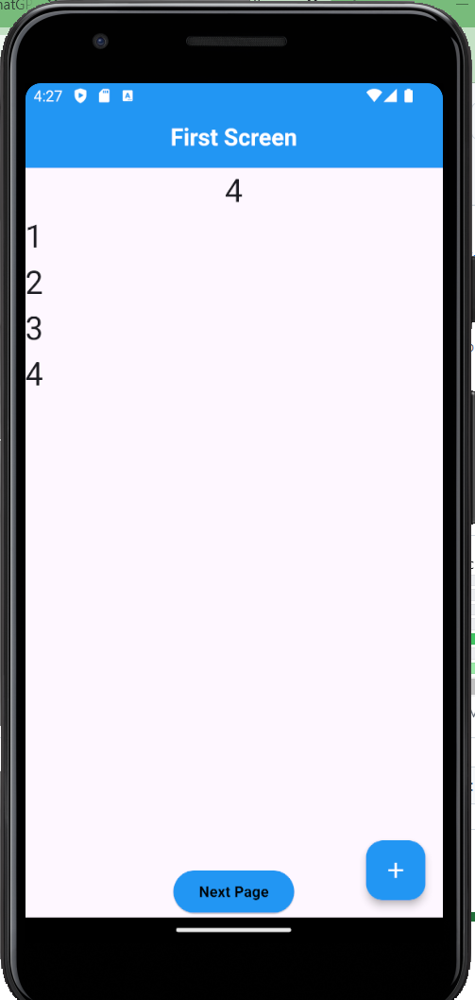
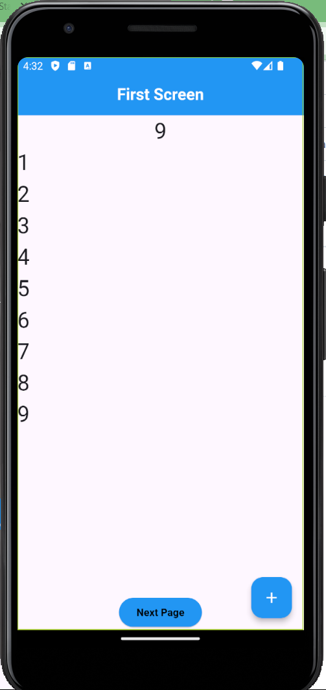
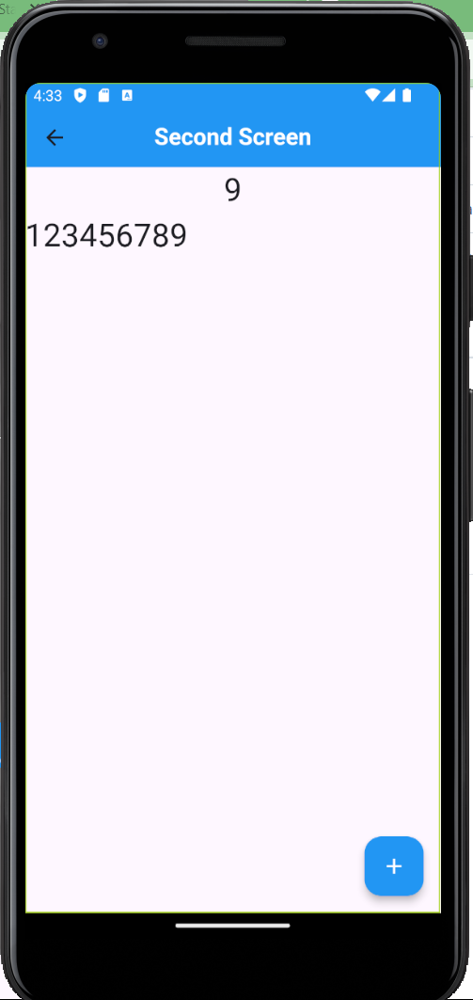

# numbers_dontLie
Here I am using state Management provider to merge two screens to display the same information

### First Screen Before incrementing takes  place

### Second Screen Before incrementing takes place

### First Screen after incrementing took place

### Second Screen after incrementing took place

